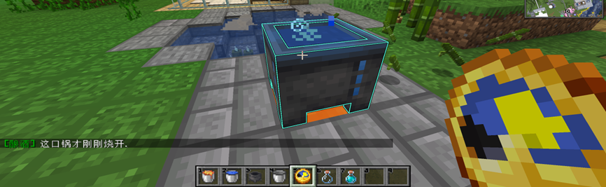
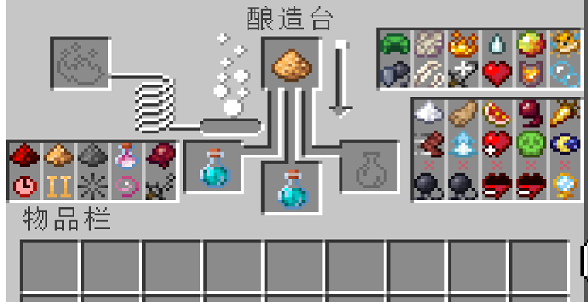
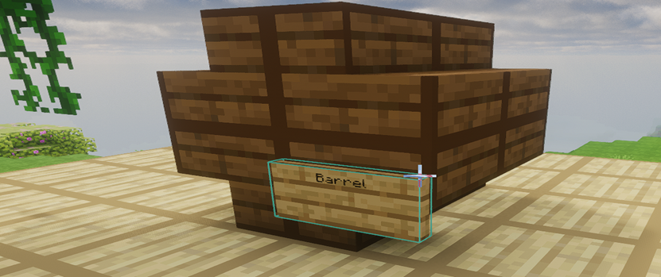
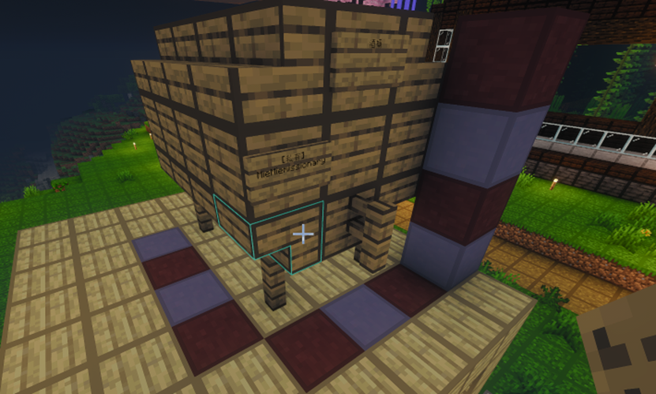

# 酿酒系统

---

## 系统特色

1. **更多的欢乐与宴会**！同时也包含一系列可能出现的负面效果，例如宿醉、反胃等。
2. **完整还原的酿造流程**：你可以不断精进自己的酿酒技法，酿造出质量上乘、效果各异的酒。
3. **超过上百种可探索的配方组合**：现实中可以用于酿酒的原料（包括 MC 中不能直接食用的）几乎都可以入酒。
4. **完善的酒品存储系统**：存储条件与年份会对酒品产生微妙而真实的影响。
5. **分享你的最佳配方**！至于质量不佳的配方喝起来会怎样……呃，还是不说的好。

---

## 酿造流程总览

所有原料 **至少需要经过`发酵`与`陈酿`** 才能最终成为酒品。

---

## 一、发酵

### 操作步骤

>1. 在装有水的 **`炼药锅`** 底部放置热源方块
   （如：火、岩浆，甚至是燃烧中的熔炉）。
>2. 手持原料 **右键投入炼药锅**。
   若有粒子冒出，说明原料正在发酵。
>3. 等待原料发酵 **数分钟**。
>4. 使用 **玻璃瓶** 将发酵完成的原液取出。

### 额外说明

>* 使用 **钟右键点击炼药锅** 可查看当前的发酵时间。
>* **发酵时间** 会直接影响最终酒的 **种类与品质**。
>
> 

---

## 二、蒸馏

### 操作步骤

>1. 将 **发酵完成的原液** 放入酿造台。
>2. 加入 **萤石粉** 并等待蒸馏完成。
>
> 

::: warning 注意事项
* **蒸馏次数** 会影响最终成品的品质与属性。
* 部分酒类 **不需要蒸馏**。
:::

---

## 三、陈酿

### 木桶搭建方式

完成搭建后即可 **右键使用酒桶**。

---

### 方案一（小型酒桶）

1. 使用 **8 个同一种类的木楼梯**，搭建如下结构（见图 1）。
2. 在右下角输入：

    * `酒桶` 或
    * `Barrel`

> 

---

### 方案二（大型酒桶）

1. 使用以下材料搭建结构（见图 2）：

    * 16 个同一种类的木楼梯
    * 5 个木栅栏
    * 18 个木板
2. 在顶部居中放置 **告示牌**，并输入：

    * `酒桶` 或
    * `Barrel`

> 

---

### 酒桶说明

* 使用 **告示牌右键酒桶任意部位** 可对酒桶进行上锁。
* 存储时间换算规则：
  **1 个 MC 游戏日 = 1 年陈酿时间**。
* 不同酒类对：

    * **存储时间**
    * **木桶木材种类**
      的要求均不相同。

---

## 配方示例

- `以下配方仅用于展示「一个完整的最优配方」是如何构成的。`
- `其他配方需要玩家自行探索。`

---

### 威士忌（Whiskey）
::: tip 配方
* **原料**：小麦
* **发酵**：每个小麦发酵 1 分钟
* **蒸馏**：需要
* **木桶**：深色木头木桶
* **陈酿时间**：年份越长越好
:::
---

### 啤酒（Beer）
::: tip 配方
* **原料**：6 个小麦
* **发酵**：8 分钟
* **蒸馏**：不需要
* **木桶**：任意木头木桶
* **陈酿时间**：3 年
:::

---

祝你在 TeaOne 中酿出属于自己的传奇佳酿！ 🍺
